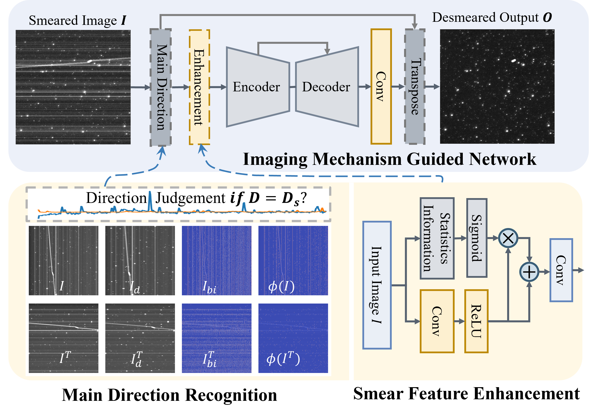
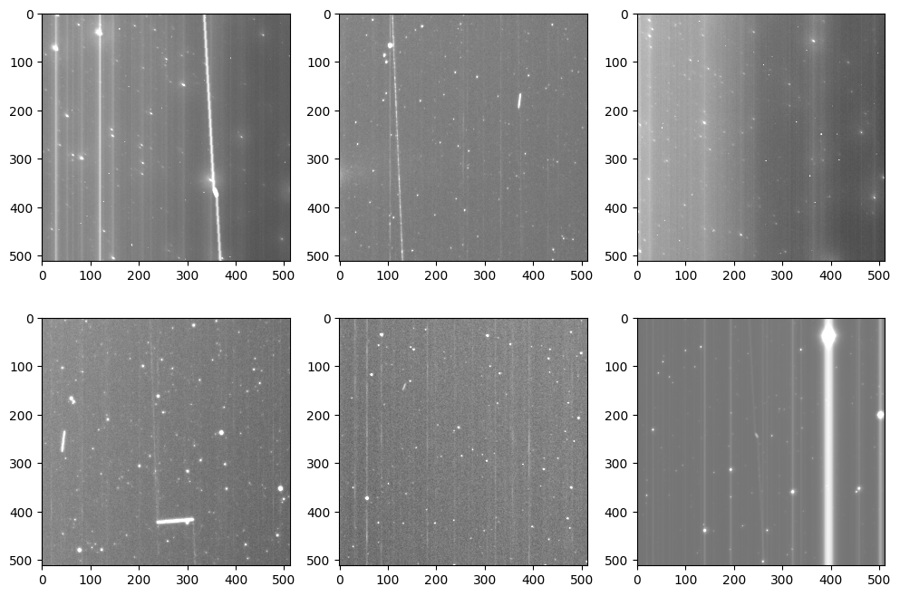
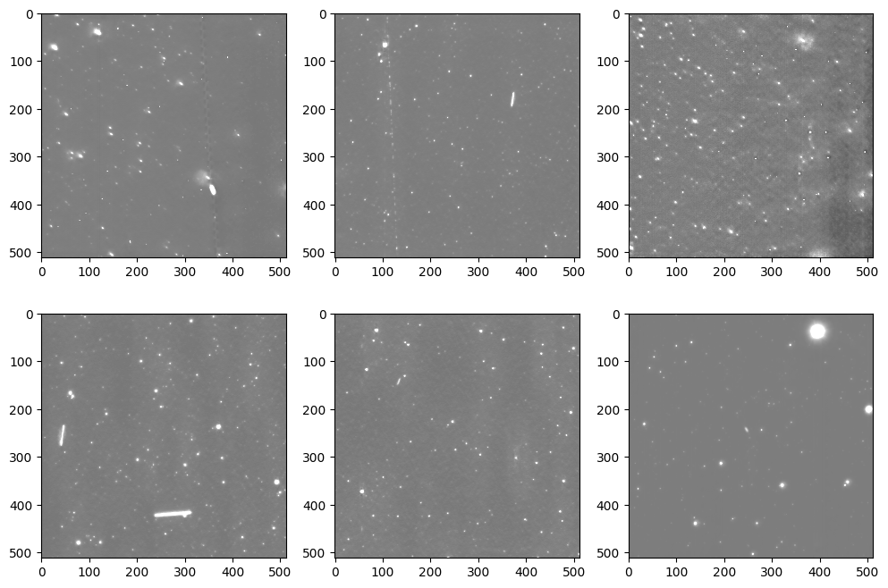

# IMGNet
**Learn to Represent and Suppress Smears with Imaging Mechanism Guided Neural Network**

# Network Framework
<div align="center">
    
</div>

# Smear Image


# Desmeared Image


# Cite IMGNet
```
Learn to Represent and Suppress Smears with Imaging Mechanism Guided Neural Network
```