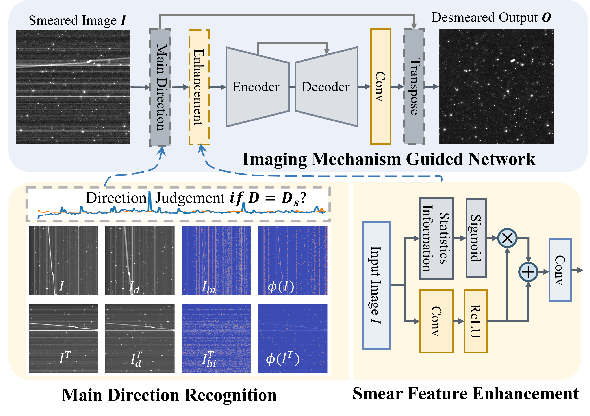
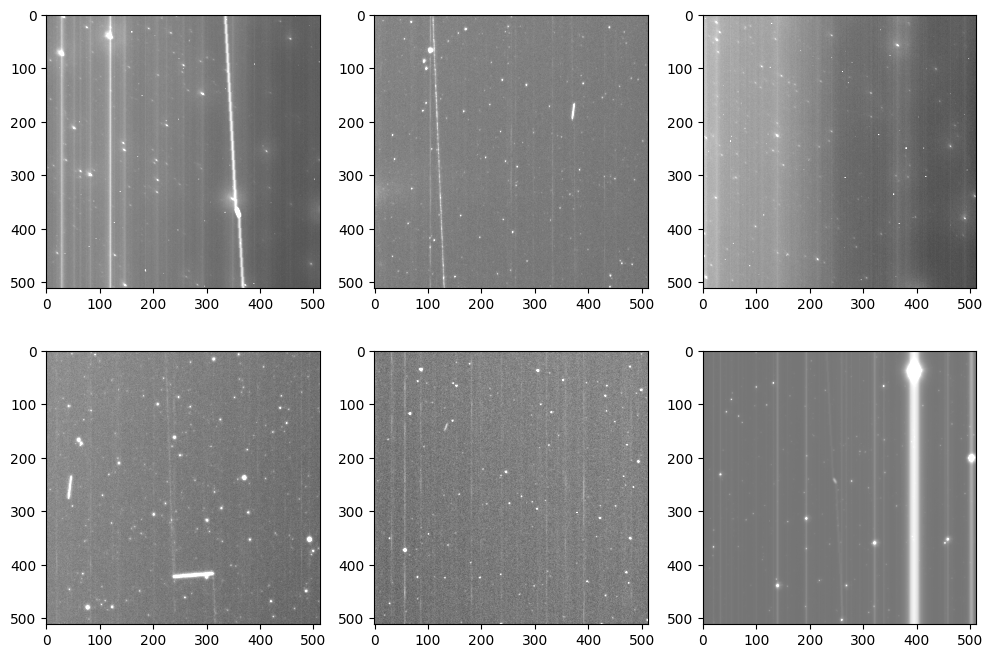
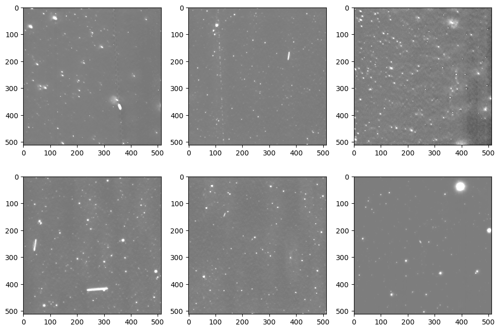

# IMGNet
**Learn to Represent and Suppress Smears with Imaging Mechanism Guided Neural Network**

# Network Framework
<div align="center">
    
</div>

# Smear Image


# Desmeared Image


# Cite IMGNet
```
Wang, H., Zhang, X., Chen, S., Zhang, T., Zhang, G., Lin, B., & Xu, X. (2025). IEEE Transactions on Industrial Informatics.
Learn to Represent and Suppress Smears With Imaging Mechanism Guided Neural Network.
```
